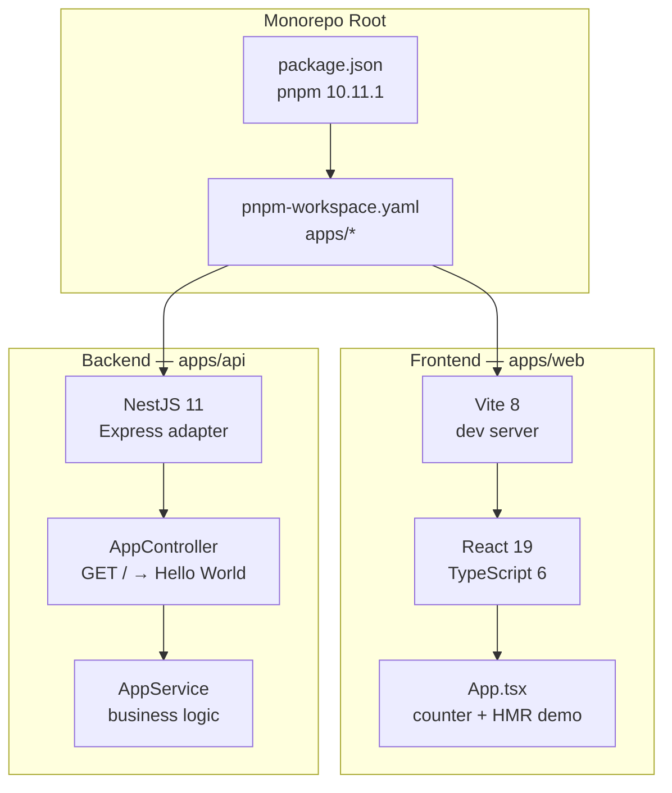

# Code Connect — Full-Stack Monorepo Starter

**pnpm monorepo with React (Vite) + NestJS, pre-configured for rapid full-stack development.**

## What It Is

Code Connect is a monorepo scaffolding for building full-stack applications. It provides a React frontend (Vite + TypeScript) and a NestJS backend API, wired together with pnpm workspaces. It's a starting point, not a finished product.

## Architecture



## Structure

```
code-connect/
├── package.json              # Root scripts (web:dev, api:dev, web:build, api:build)
├── pnpm-workspace.yaml       # Workspace: apps/*
├── pnpm-lock.yaml
├── apps/
│   ├── web/                  # React + Vite + TypeScript
│   │   ├── package.json      # @code-connect/web
│   │   ├── src/
│   │   │   ├── App.tsx       # Counter demo with HMR
│   │   │   ├── App.css
│   │   │   ├── index.css
│   │   │   └── main.tsx
│   │   ├── vite.config.ts
│   │   └── tsconfig.json
│   └── api/                  # NestJS + TypeScript
│       ├── package.json      # @code-connect/api
│       ├── src/
│       │   ├── main.ts       # Bootstrap (port 3000)
│       │   ├── app.module.ts
│       │   ├── app.controller.ts  # GET / → Hello World
│       │   └── app.service.ts
│       ├── nest-cli.json
│       └── tsconfig.json
```

## Scripts

| Command | What It Does |
|---------|-------------|
| `pnpm web:dev` | Start React dev server (Vite HMR) |
| `pnpm web:build` | Build React for production |
| `pnpm api:dev` | Start NestJS in watch mode |
| `pnpm api:build` | Build NestJS for production |

## Tech Stack

| Layer | Technology |
|-------|-----------|
| **Package Manager** | pnpm 10.11.1 (workspaces) |
| **Frontend** | React 19, Vite 8, TypeScript 6 |
| **Backend** | NestJS 11, Express, TypeScript 5.7 |
| **Linting** | oxlint (web), ESLint + Prettier (api) |
| **Testing** | Jest 30 (api) |

## Status

Scaffolded and functional. Both apps boot and respond. Ready for feature development.
