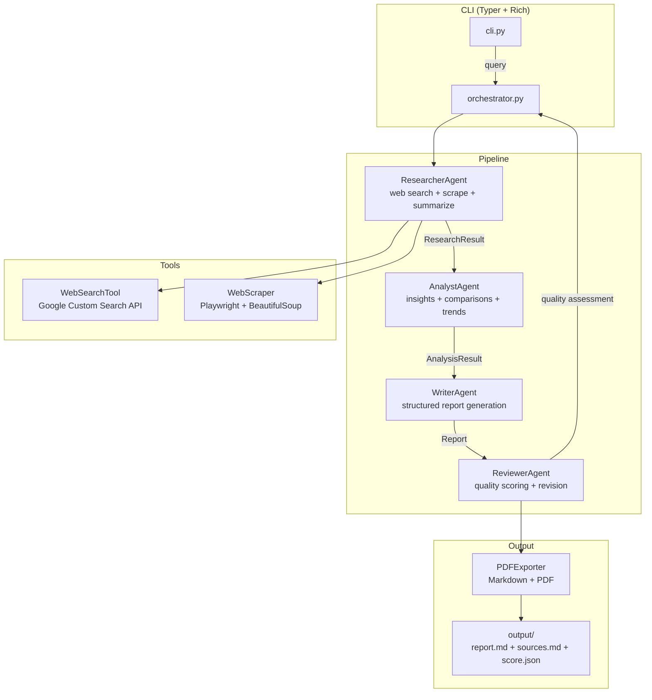
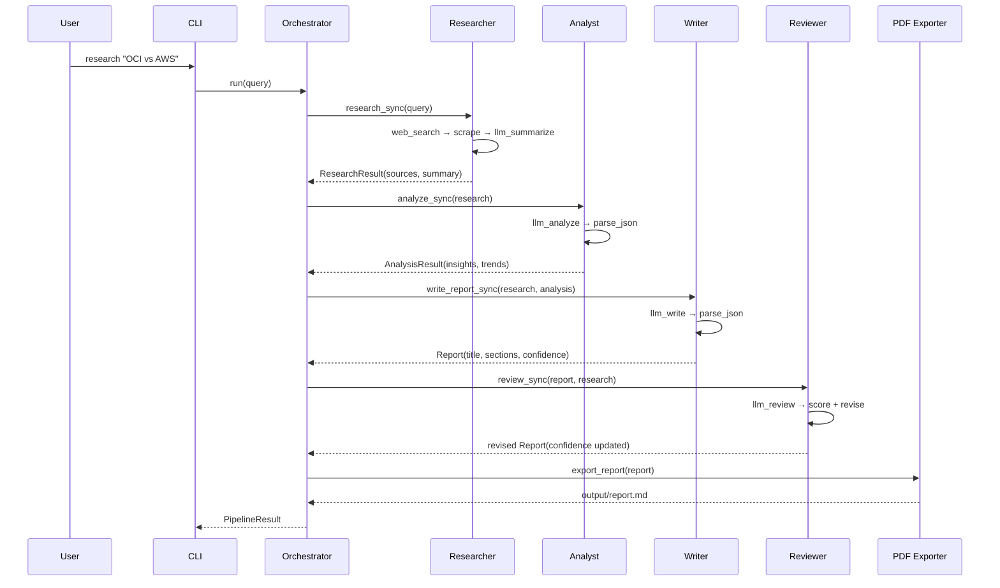

# LangChain Research Analyst — Multi-Agent RAG Pipeline

**4-agent research system using LangChain + Google Gemini. Specialized agents (Researcher → Analyst → Writer → Reviewer) collaborate to produce reports with confidence scoring.**

## What It Does

Takes a research query, dispatches it through a 4-agent pipeline, and produces a structured Markdown report with sources, confidence scores, and PDF export.

## Architecture



## Agent Roles

| Agent | Responsibility | LLM Temp | Input → Output |
|-------|---------------|----------|----------------|
| **Researcher** | Web search, scrape URLs, generate summary | 0.3 | query → `ResearchResult` |
| **Analyst** | Extract insights, comparisons, trends, recommendations | 0.4 | `ResearchResult` → `AnalysisResult` |
| **Writer** | Generate structured report (title, executive summary, intro, analysis, conclusions) | 0.5 | `ResearchResult` + `AnalysisResult` → `Report` |
| **Reviewer** | Quality assessment (structure, evidence, clarity), revision, confidence scoring | 0.2 | `Report` → revised `Report` |

## Data Flow



## Tools

| Tool | Technology | Purpose |
|------|-----------|---------|
| **WebSearchTool** | Google Custom Search API | Find relevant URLs for query |
| **WebScraper** | Playwright + BeautifulSoup + Markdownify | Extract page content as Markdown |
| **PDFExporter** | Markdown → file | Export report to `output/` |

## Configuration

| Variable | Default | Purpose |
|----------|---------|---------|
| `GOOGLE_STUDIO_API_KEY` | Required | Gemini API key |
| `GEMINI_MODEL` | `gemini-1.5-flash` | LLM model |
| `MAX_SOURCES` | `10` | Max sources per research |
| `SOURCE_TIMEOUT` | `30` | Scrape timeout (seconds) |
| `OUTPUT_DIR` | `output` | Report output directory |

## Usage

```bash
python -m src.cli research "Comparar OCI vs AWS para workloads de IA"
python -m src.cli research "Tendencias de AI em 2026" --verbose
python -m src.cli list-reports
python -m src.cli review ./output/report.md
```

## Project Structure

```
langchain_hands_on/
├── src/
│   ├── cli.py              # Typer CLI
│   ├── config.py           # Pydantic settings
│   ├── orchestrator.py     # Pipeline coordination + progress display
│   ├── workflow.py         # LangGraph wrapper (StateGraph + SQLite + HITL)
│   ├── agents/
│   │   ├── researcher.py   # Web search + scrape + summarize
│   │   ├── analyst.py      # Insights + comparisons + trends
│   │   ├── writer.py       # Structured report generation
│   │   ├── reviewer.py     # Quality scoring + revision
│   │   ├── react_agent.py  # ReAct agent variant
│   │   ├── researcher_v2.py
│   │   └── analyst_v2.py
│   ├── tools/
│   │   ├── web_search.py   # Google Custom Search
│   │   ├── scraper.py      # Playwright + BeautifulSoup
│   │   └── pdf_export.py   # Markdown export
│   ├── models/             # Pydantic schemas (Report, Source, Insight)
│   └── utils/              # Logger
├── tests/
│   ├── test_agents.py
│   ├── test_tools.py
│   └── test_orchestrator.py
├── output/                 # Generated reports
├── Dockerfile
└── pyproject.toml
```

## Tech Stack

- **Framework**: LangChain, LangGraph (workflow.py)
- **LLM**: Google Gemini 1.5 Flash
- **Scraping**: Playwright (headless Chromium), BeautifulSoup, Markdownify
- **CLI**: Typer + Rich (progress bars, panels)
- **Models**: Pydantic (schemas, config)
- **Export**: Markdown + PDF
- **Testing**: pytest + coverage
