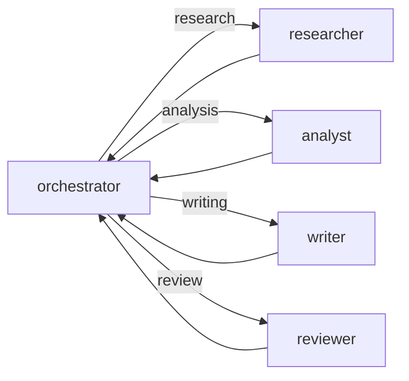
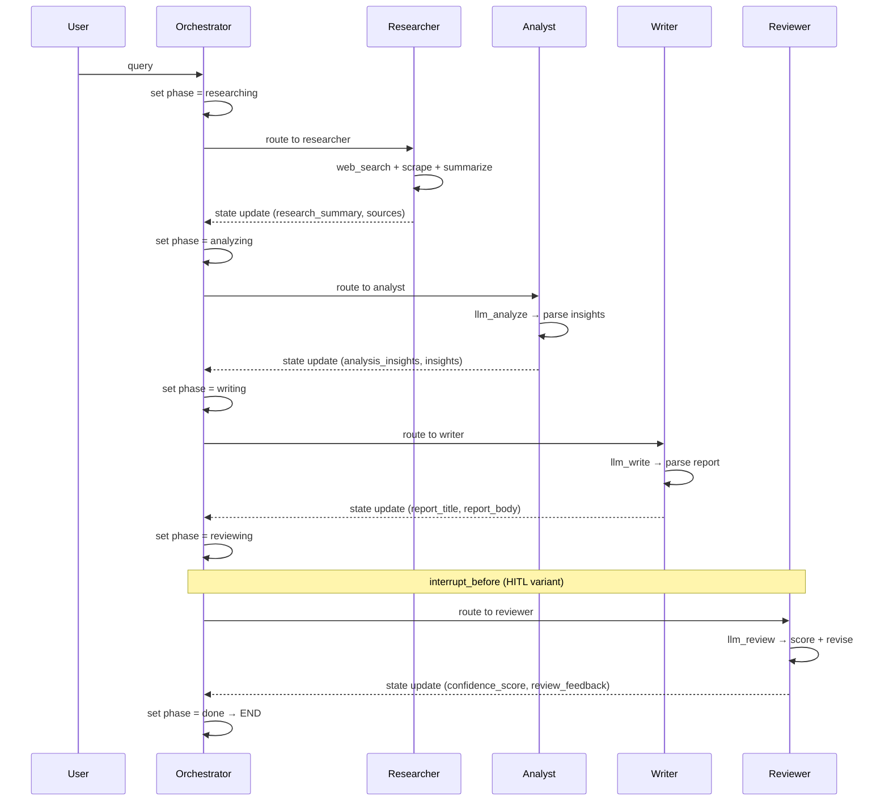

# LangGraph Multi-Agent System — Stateful Research Pipeline

**Stateful multi-agent research system using LangGraph. Explicit state (TypedDict), conditional routing, SQLite persistence, HITL interrupts, and cycle detection.**

## What It Does

Same 4-agent pipeline as LangChain version, but rebuilt on LangGraph for explicit state management, checkpointing, human-in-the-loop, and resumable workflows.

## Architecture

```mermaid
graph TD
    subgraph "CLI"
        CLI[cli.py] -->|query| ORC[orchestrator.py]
    end

    subgraph "LangGraph StateGraph"
        ORC --> G[create_workflow]
        G --> ORN[orchestrator_node<br/>decides next phase]
        ORN -->|conditional| R[researcher_node]
        ORN -->|conditional| A[analyst_node]
        ORN -->|conditional| W[writer_node]
        ORN -->|conditional| V[reviewer_node]
        ORN -->|COMPLETE| END[END]
        R -->|back to| ORN
        A -->|back to| ORN
        W -->|back to| ORN
        V -->|back to| ORN
    end

    subgraph "State (TypedDict)"
        ST[AgentState<br/>query, phase, sources,<br/>insights, report, score,<br/>iteration, messages]
    end

    subgraph "Variants"
        HITL[workflow_hitl.py<br/>interrupt_before reviewer]
        PERS[workflow_persistent.py<br/>SqliteSaver checkpoints]
    end
```

## LangGraph vs LangChain

| Feature | LangChain (this project) | LangGraph (this project) |
|---------|-------------------------|-------------------------|
| State | Implicit (passed between agents) | Explicit (`AgentState` TypedDict) |
| Workflow | Sequential pipeline | Graph with conditional routing |
| Routing | Fixed order | Dynamic (orchestrator decides next) |
| Cycles | No | Yes (agents loop back to orchestrator) |
| Persistence | Manual | SQLite checkpointer built-in |
| HITL | Not implemented | `interrupt_before` on reviewer |
| Iteration | Single pass | Up to `max_iterations` (default 5) |

## Workflow Variants

### 1. Basic (`workflow.py`)

Simple graph. No persistence. Single execution.

### 2. Persistent (`workflow_persistent.py`)
Same graph, but compiled with `SqliteSaver` checkpointer. State survives across executions. Can resume from any checkpoint.

### 3. HITL (`workflow_hitl.py`)
Same graph, compiled with `SqliteSaver` + `interrupt_before=["reviewer"]`. Pauses before reviewer for human approval. Human approves → continues. Human rejects → can revise state and retry.

## State Schema

```python
class AgentState(TypedDict):
    query: str                    # Original research query
    current_phase: str            # researching | analyzing | writing | reviewing | done
    research_summary: str         # Researcher output
    sources: list[Source]         # Collected sources
    analysis_insights: str        # Analyst output
    insights: list[Insight]       # Structured insights
    report_title: str             # Writer output
    report_body: str              # Writer output
    review_feedback: str          # Reviewer output
    confidence_score: float       # Quality score (0-1)
    iteration: int                # Current iteration count
    max_iterations: int           # Safety limit (default 5)
    should_continue: bool         # Control flag
    messages: list                # Agent communication log
```

## Data Flow



## Files

```
langraph_hands_on/
├── src/
│   ├── cli.py                  # Typer CLI
│   ├── config.py               # Pydantic settings
│   ├── orchestrator.py         # Pipeline execution + progress
│   ├── workflow.py             # Basic StateGraph
│   ├── workflow_persistent.py  # SqliteSaver persistence
│   ├── workflow_hitl.py        # HITL with interrupt
│   ├── agents/
│   │   ├── __init__.py         # All agent nodes exported
│   │   ├── orchestrator.py     # Phase routing logic
│   │   ├── researcher.py       # Web search + scrape
│   │   ├── analyst.py          # Insights extraction
│   │   ├── writer.py           # Report generation
│   │   ├── reviewer.py         # Quality scoring
│   │   └── pydantic_router.py  # Structured output routing
│   ├── states/
│   │   └── __init__.py         # AgentState, WorkflowPhase, create_initial_state
│   ├── memory/                 # Memory management
│   ├── tools/
│   │   ├── web_search.py       # Google Custom Search
│   │   ├── scraper.py          # Playwright + BeautifulSoup
│   │   └── pdf_export.py       # Markdown export
│   └── utils/                  # Logger
├── tests/
│   ├── test_agents.py
│   ├── test_workflow.py
│   └── test_states.py
├── output/                     # Generated reports
├── Dockerfile
└── pyproject.toml
```

## Key Differences from LangChain Version

1. **Orchestrator as graph node** — decides routing dynamically instead of fixed pipeline
2. **Agents loop back** — every agent returns to orchestrator for next decision
3. **Explicit state** — `AgentState` TypedDict with all fields visible and debuggable
4. **Checkpointing** — SQLite persistence enables resume from any point
5. **HITL interrupts** — `interrupt_before` pauses execution for human input
6. **Cycle detection** — `max_iterations` prevents infinite loops
7. **Streaming** — `graph.stream()` enables step-by-step execution visibility

## Tech Stack

- **Framework**: LangGraph, LangChain
- **LLM**: Google Gemini 2.0 Flash
- **State**: TypedDict (explicit, typed)
- **Persistence**: SQLite (SqliteSaver)
- **HITL**: `interrupt_before` + `update_state`
- **Scraping**: Playwright, BeautifulSoup, Markdownify
- **CLI**: Typer + Rich
- **Testing**: pytest + coverage
